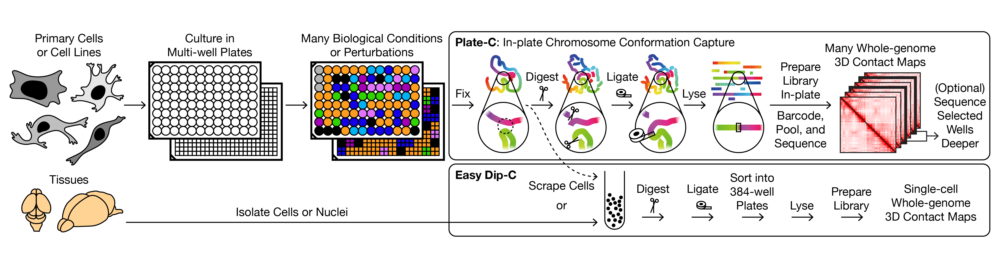
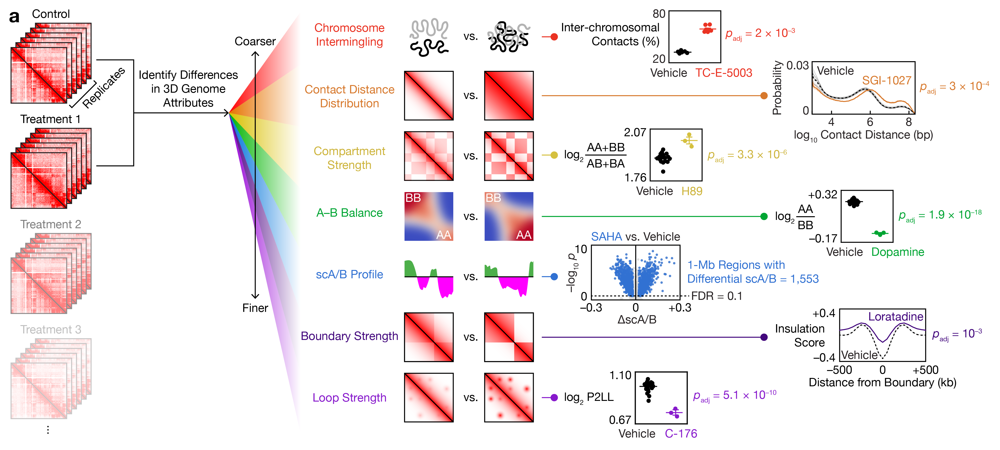

# Plate-C

Code and tools to analyze Plate-C data.

## Introduction



**Plate-C** ("in-plate chromosome conformation capture") is a high-throughput, cost-effective Hi-C platform that profiles thousands of whole-genome 3D architectures in a day. Cells are cultured directly in 96- or 384-well plates, perturbed with diverse biological or chemical conditions, and processed in-plate through an optimized workflow that integrates Hi-C (fixation, digestion, ligation) with library preparation (lysis, transposition, barcoded amplification) — without biotin pull-down or bead transfers.

This repository contains the code used to analyze Plate-C bulk data and the companion single-cell method **Easy Dip-C** ("easy diploid chromosome conformation capture"), which applies the same in-suspension chemistry to individual nuclei sorted into 384-well plates.

Together, these tools were used to generate the first chemical screen for whole-genome 3D architectural changes: 2,956 genome-wide contact maps across 834 biological conditions in 5 neuronal and glial cell types, accompanied by 6,081 single cells and 200,893 single-cell transcriptomes.

## Citation

If you use Plate-C or this code, please cite our preprint:

Parasar, B.\*, Venkatesh, A.R., Perera, J., Sosnick, L., Moghadami, S., Seo, Y., Shi, J., Chan, L., Takenawa, S., Akiyama, T., Sianto, O., Uenaka, T., Hadjipanayis, A., Wernig, M., Gitler, A.D., Tan, L.† "Whole-genome 3D architectural screen reveals modulators of brain DNA structure." *bioRxiv* (2026).

Correspondence: tttt@stanford.edu

## Data Availability

- **Raw sequencing reads** — [SRA: PRJNA1234645](https://www.ncbi.nlm.nih.gov/bioproject/PRJNA1234645)
- **Processed data** — [Zenodo: 10.5281/zenodo.15021657](https://doi.org/10.5281/zenodo.15021657)

## Repository Contents

| Folder | Description |
| --- | --- |
| `analyze_scab` | MATLAB code for the primary Plate-C analysis: scA/B compartment profiling, quantification of architectural attributes (chromosome intermingling, contact distance distribution, compartment strength, A–B difference, boundary strength, loop strength), and statistical testing across conditions. |
| `analyze_compartments` | Notebooks for calling A/B compartments, computing compartment eigenvectors, and comparing eigenvector/insulation profiles between Plate-C bulk and Easy Dip-C aggregated data. |
| `analyze_rna` | MATLAB code for integrating bulk and single-cell RNA-seq with scA/B changes (e.g., correlating gene expression trajectories with compartment remodeling under CI-994, TSA, and other perturbations). |
| `plot_contact_maps` | Python scripts for generating differential chromatin contact maps, A/B tracks, and genome-wide heatmaps shown in the figures. Includes `plot_ab_tracks_heatmap.py`. |

## Requirements

Tested on macOS and Linux (CentOS/Ubuntu).

**Python (≥3.8)**
- NumPy
- SciPy
- pandas
- matplotlib
- scikit-learn (for PCA, UMAP inputs, k-means)
- umap-learn

**MATLAB (R2021b or later)** — for `analyze_scab` and `analyze_rna`.

**R (≥4.0)** — for selected differential expression and statistics scripts.

**External tools**
- [BWA](https://github.com/lh3/bwa) — read alignment
- [SAMtools](http://www.htslib.org/) — BAM handling
- [hickit](https://github.com/lh3/hickit) — contact extraction and (for Easy Dip-C) haplotype imputation
- [dip-c](https://github.com/tanlongzhi/dip-c) — single-cell 3D genome analysis (Easy Dip-C downstream)
- [Juicer Tools](https://github.com/aidenlab/juicer) — optional, for `.hic` conversion

## Typical Workflow

### 1. Align and extract contacts

Each Plate-C sample is demultiplexed by its well barcode, then processed identically to standard Hi-C:

```bash
# Align paired-end reads
bwa mem -5SP genome.fa R1.fq.gz R2.fq.gz | gzip > aln.sam.gz

# Extract contact segments with hickit
hickit.js sam2seg aln.sam.gz | hickit.js chronly - | hickit.js bedflt ${blacklist_file} - | gzip > contacts.seg.gz
hickit --dup-dist=1 -i contacts.seg.gz -o - | bgzip > contacts.pairs.gz

# Use dip-C pipeline to generate the color2s file, which can be used for downstream analysis

```

Typical yields: ~30% of Plate-C reads contain contacts (20% for Easy Dip-C), compared to ~5% for other biotin-free methods.

### 2. Quantify multi-scale architectural changes



`analyze_scab/` implements the 7-attribute statistical framework:

1. Chromosome intermingling (fraction of interchromosomal contacts)
2. Contact distance distribution
3. Compartment strength (log₂ [AA + BB] / [AB + BA])
4. A–B difference (log₂ AA / BB)
5. Locus-level scA/B profile (1-Mb bins)
6. Boundary strength (insulation score)
7. Loop strength (P2LL: peak-to-lower-left ratio)

For each attribute, p-values are computed with two-sided equal-variance *t*-tests and corrected with Benjamini–Hochberg (FDR 0.1 for scA/B loci).

### 3. Single-cell analysis with Easy Dip-C

Single nuclei are sorted into 384-well plates and processed with the same in-suspension chemistry. Downstream analysis uses the companion [`dip-c`](https://github.com/tanlongzhi/dip-c) toolkit for scA/B calling, UMAP embedding, and cell-type annotation. See that repository for file format specifications (`.seg`, `.con`, `.3dg`, `.reg`).

### 4. Transcriptomic analysis

`analyze_rna/` contains MATLAB code for bulk and single-nucleus RNA-seq processing, including DEG calling between treated and control conditions and correlation of expression changes with scA/B changes.

## Related Repositories

- [`tanlongzhi/dip-c`](https://github.com/tanlongzhi/dip-c) — upstream Dip-C analysis tools, used for single-cell 3D genome analysis downstream of Easy Dip-C.
- [`3d-genome/plate-c`](https://github.com/3d-genome/plate-c) — upstream repository this fork is based on.

## Contact

For questions about the code, please open an issue. For correspondence about the study, contact Longzhi Tan (tttt@stanford.edu).
